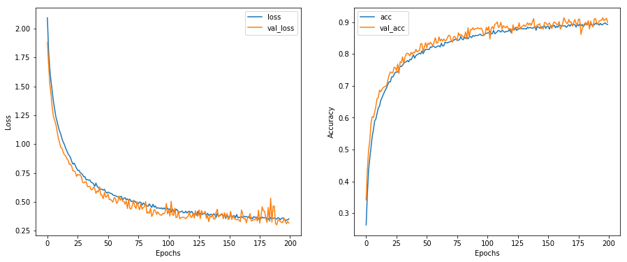
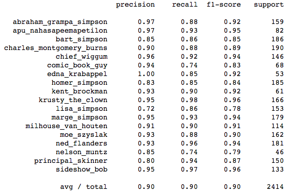
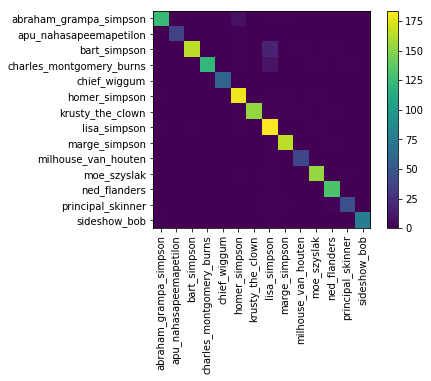
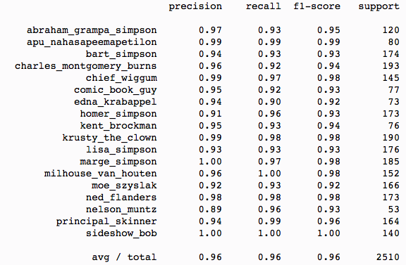
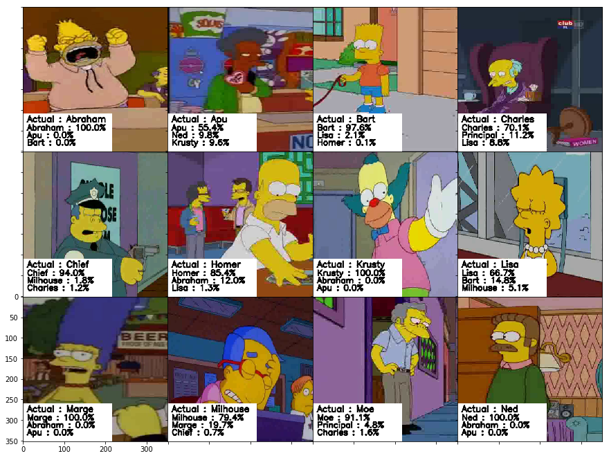
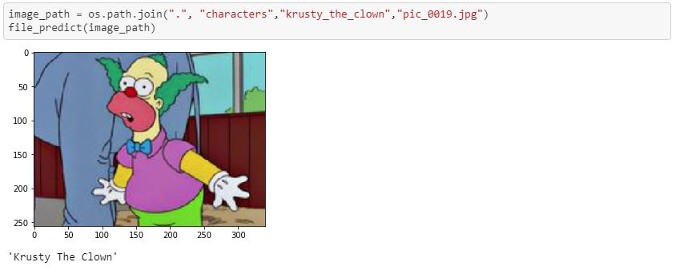
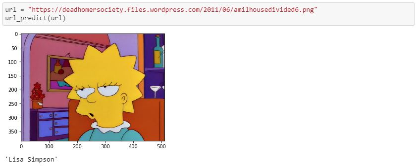

# THE SIMPSONS CHARACTER RECOGNITION APPLICATION

Members: Daniel Fischer, Mo Habib, Fazliddin Naimov, Kevin Freehill, Dahmane Skendraoui, Peter Kim

[Final Presentation](#)

[Visit Deployed Page](#)

## ABOUT

Deep Learning : Training a convolutional neural network to recognize The Simpsons characters. Our approach to solve this problem will be based on convolutional neural networks (CNNs) : multi-layered feed-forward neural networking able to learn many features.

Technology Stack Used:
- Python
- HTML/CSS/Bootstrap/Javascript
- Keras
- Tensorflow
- CNN
- Flask

## PROCESS
### CNN Model
#### Dataset
We used kaggle Simpsons dataset that has more than 40 characters pictures. For training we only used characters that have more than 290 pictures.

```python
characters = [k.split('/')[2] for k in glob.glob('./characters/*') if len([p for p in glob.glob(k+'/*') if 'edited' in p or 'pic_vid' in p]) > 290]
```

[Dataset Link](https://www.kaggle.com/alexattia/the-simpsons-characters-dataset)

#### Training
Spliting the data to Train and Test using get_dataset function from train.py.

```python
imp.reload(train)
X_train, X_test, y_train, y_test = train.get_dataset(save=True)
```

We used a feed forward 4 convolutional layers with ReLU activation followed by a fully connected hidden layer. The model iterated over batches of training set (batch size : 32) for 200 epochs. We also used data augmentation that did a number of random variations over the pictures so the model never see the same picture twice. This helps prevent overfitting and helps the model generalize better.

```python
datagen = ImageDataGenerator(
 featurewise_center=False, # set input mean to 0 over the dataset
 samplewise_center=False, # set each sample mean to 0
 featurewise_std_normalization=False, # divide inputs by std 
 samplewise_std_normalization=False, # divide each input by its std
 rotation_range=0, # randomly rotate images in the range 
 width_shift_range=0.1, # randomly shift images horizontally 
 height_shift_range=0.1, # randomly shift images vertically 
 horizontal_flip=True, # randomly flip images
 vertical_flip=False) # randomly flip images
 ```
Loss and Accuracy (Validation and Training) during training


#### Classification evaluation
The accuracy (f1-sport) is really good : above 90 % for every character except Lisa. The precision for Lisa is 82%. Maybe Lisa is mixed up with other characters.





#### Improving the CNN model

To make the neural net understands more details and more complexity, we can got deeper and add more convolutional layers. We tried with 6 convolutional layers and going deeper (dimensions of the output space 32, 64, 512 vs 32, 64, 256, 1024) . It has improved the accuracy (precision and recall) as you can see below. The lower precision is 0.89 for Nelson Muntz and we only had 300 training examples for this character. Moreover, this model converge quicker : only 40 epochs (vs 200).



#### Visualizing predicted characters



#### Predict from file and URL
Created two functions that uses model to predict from image and URL.

```python
def file_predict(image_path, all_perc=False):
    image = cv2.imread(image_path)
    img = cv2.cvtColor(image, cv2.COLOR_BGR2RGB)
    plt.imshow(img)
    plt.show()
    pic = cv2.resize(image, (64,64))
    a = model.predict_proba(pic.reshape(1, 64, 64,3))[0]
    if all_perc:
        print('\n'.join(['{} : {}%'.format(map_characters[i], round(k*100)) for i,k in sorted(enumerate(a), key=lambda x:x[1], reverse=True)]))
    else:
        return map_characters[np.argmax(a)].replace('_',' ').title()
def url_predict(url, all_perc=False):
    image = url_to_image(url)
    img = cv2.cvtColor(image, cv2.COLOR_BGR2RGB)
    plt.imshow(img)
    plt.show()
    pic = cv2.resize(image, (64,64))
    a = model.predict_proba(pic.reshape(1, 64, 64,3))[0]
    if all_perc:
        print('\n'.join(['{} : {}%'.format(map_characters[i], round(k*100)) for i,k in sorted(enumerate(a), key=lambda x:x[1], reverse=True)]))
    else:
        return map_characters[np.argmax(a)].replace('_',' ').title()
```



### Flask

Flask connected the python server to JavaScript.  Test Simpsons image were converted to array values then passed to JavaScript.

@app.route("/")
def index():
    return render_template("index.html")


@app.route('/predict', methods=['GET', 'POST'])
def predict():

### HTML/CSS/JS

JavaScript convert the array to base64 string for transport to the server for prediction.  The result was then passed through JavaScript then to HTML.  

    // Predict
    function getPrediction() {

        var imageInput = $('#imagePreview').attr('style').split(",")[1];

        var base64ImageData = imageInput.substring(0,imageInput.length-3);
        
        $(this).hide();
        $('.loader').show();

        fetch("/predict",{
            method: "POST",
            body: JSON.stringify({image:base64ImageData}),
            headers: {
                'Content-Type': 'application/json'
                // 'Content-Type': 'application/x-www-form-urlencoded',
            },
        }
 
## FINAL APPLICATION
